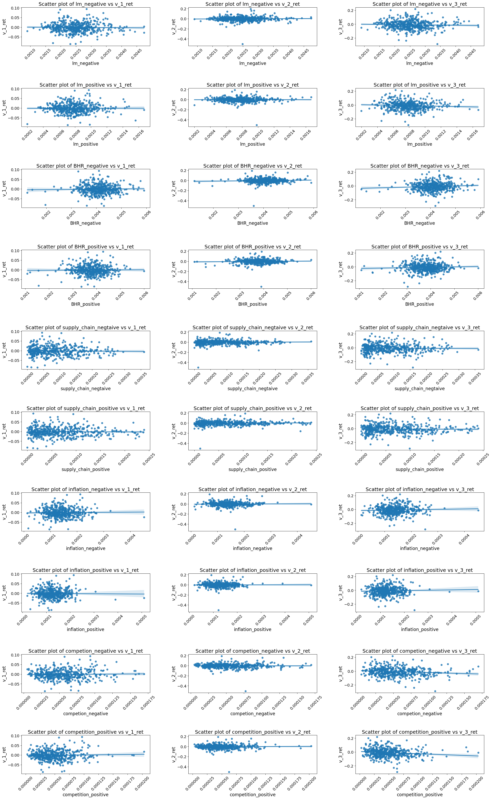

---
layout: wide_default
---    
# 10k Sentiment and Stock Returns: A Historical Analysis
By: Nicholas Scheri Lehigh University '25, Finance and Business Analytics

# Table of Contents:
### I Summary
- I(A) Background and Research Question
- I(B) Research Workflow
- I(C) Preliminary Findings
### II Data
- II(A) Sample: A Deeper Look
- II(B) Sentiment: Constructing Measures of Sentiment and Contextual Sentiment
- II(C) Sentiment: Assessing Measures 
- II(D) Return Calculation
- II(E) Sample: Statistics and Commentary
- II(F) Caveats to the data
### III Results
- III (A) Correlation Metrics
- III (B) Visualizations
- III (C) Additional Topics of Discussion
    - III(C.i) Assesing Sentiment Dictionary Differences
    - III(C.ii) Garcia, Hu, & Rohrer (2022) considerations and comparison
    - III(C.iii) Contextual Sentiment Results
    - III(C.iv) Garcia, Hu, and Rohrer (2022) Dictionary and Effects on Return


```python
#packages
import numpy as np
import pandas as pd
import seaborn as sns
import matplotlib.pyplot as plt
```


```python
#Open file
analysis_sample = pd.read_csv('output/analysis_sample.csv')

file = open('inputs/ML_negative_unigram.txt','r')
    #Create the list it will be added to
BHR_negative = []
    #for each line of the file, remove extra spacing and add to the list
for line in file:
    BHR_negative.append(line.strip())
    #Close
file.close
# BHR_negative


file2 = open('inputs/ML_positive_unigram.txt', 'r')
BHR_positive = []
for line in file2:
    BHR_positive.append(line.strip())
file2.close
# BHR_positive


#Since this is a csv file, I can just read this in and then manipulate the df to make my lists
lm = pd.read_csv('inputs/LM_MasterDictionary_1993-2021.csv')
lm_positives = []
lm_negatives = []

#words classified are given value 2009 if positive or negtaive, otherwise they are assigned 0 (no value)
#so, for every row in the lm df, if positive or negative have a value greater than zero in them, add the word to the corresponding list
for index, row in lm.iterrows():
    if row['Positive'] > 0:
        lm_positives.append(row['Word'])
    elif row['Negative'] > 0:
        lm_negatives.append(row['Word'])

#make lists lower case to match the lm lists
lm_positive = []
for word in lm_positives:
    lm_positive.append(word.lower())

lm_negative = []
for word in lm_negatives:
    lm_negative.append(word.lower())

sentiment= analysis_sample[['lm_negative', 'lm_positive', 'BHR_negative', 'BHR_positive', 'supply_chain_negtaive', 'supply_chain_positive', 'inflation_negative','inflation_positive', 'competion_negative', 'competition_positive' ]]
returns= analysis_sample[['v_1_ret', 'v_2_ret', 'v_3_ret']]

```

# I: Summary

I(A): <br>
This analysis of builds on the study of textual data as an explanatory variable of stock prices. Specifically, this analysis assess potential relationship between the sentiment (both overall and *contextually*) of a 10k filing, and the proceeding stock returns over the next 10 days. <br> <br>
I(B): <br>
Said Analysis was conducted through the acquisition of firm filings (form 10k) and stock return data. The sample for this analysis included the 2022 list of firms in the S&P 500 and their according returns. Dictionaries from Garcia, Hu, and Rohrer (2022) and Loughran-McDonald Master Dictionary were used as base dictionaries for sentiment. Sentiment was further measured on a contextual basis surrounding the areas of supply chain, inflation, and competition. Sentiment measurements were tested for correlation with stock returns over 3 different holding periods: 0 days, 3 days, and 10 days. <br> <br>
I(C): <br>
As per statistical analysis of this sample, minimal to no relationship was found between sentiment in 10k filings and all stock returns both on a general and contextual level.<br> <br>


# II Data

**II(A)**: <br> <br>
The sample used for analysis consists of the 2022 list of S&P500 firms and associated variables, returns for each security in the corresponding year, compounded to three periods: date of 10k filing date, three days after failing date, and ten days after filing date. Each observation of firm also has 10 sentiment measurements: a positive and negative measurement for both the Garcia, Hu, and Rohrer (2022) dictionary and Loughran-McDonald master dictionary, and a positive and negative measurement for each of the the following contextual variables: supply chain, inflation, and competition. Contextual variables were measured in sentiment using the Garcia, Hu, and Rohrer (2022) dictionary. A list of all variables is below:


```python
#Variables
import pandas as pd
columns = pd.DataFrame(analysis_sample.columns)
columns = columns[1:]
columns.columns = ["Variables"]
columns
```


<div>
<style scoped>
    .dataframe tbody tr th:only-of-type {
        vertical-align: middle;
    }

    .dataframe tbody tr th {
        vertical-align: top;
    }

    .dataframe thead th {
        text-align: right;
    }
</style>
<table border="1" class="dataframe">
  <thead>
    <tr style="text-align: right;">
      <th></th>
      <th>Variables</th>
    </tr>
  </thead>
  <tbody>
    <tr>
      <th>1</th>
      <td>Symbol</td>
    </tr>
    <tr>
      <th>2</th>
      <td>Security</td>
    </tr>
    <tr>
      <th>3</th>
      <td>SEC filings</td>
    </tr>
    <tr>
      <th>4</th>
      <td>GICS Sector</td>
    </tr>
    <tr>
      <th>5</th>
      <td>GICS Sub-Industry</td>
    </tr>
    <tr>
      <th>6</th>
      <td>Headquarters Location</td>
    </tr>
    <tr>
      <th>7</th>
      <td>Date first added</td>
    </tr>
    <tr>
      <th>8</th>
      <td>CIK</td>
    </tr>
    <tr>
      <th>9</th>
      <td>Founded</td>
    </tr>
    <tr>
      <th>10</th>
      <td>lm_positive</td>
    </tr>
    <tr>
      <th>11</th>
      <td>lm_negative</td>
    </tr>
    <tr>
      <th>12</th>
      <td>BHR_positive</td>
    </tr>
    <tr>
      <th>13</th>
      <td>BHR_negative</td>
    </tr>
    <tr>
      <th>14</th>
      <td>accession_number</td>
    </tr>
    <tr>
      <th>15</th>
      <td>supply_chain_positive</td>
    </tr>
    <tr>
      <th>16</th>
      <td>supply_chain_negtaive</td>
    </tr>
    <tr>
      <th>17</th>
      <td>inflation_positive</td>
    </tr>
    <tr>
      <th>18</th>
      <td>inflation_negative</td>
    </tr>
    <tr>
      <th>19</th>
      <td>competition_positive</td>
    </tr>
    <tr>
      <th>20</th>
      <td>competion_negative</td>
    </tr>
    <tr>
      <th>21</th>
      <td>filing_date</td>
    </tr>
    <tr>
      <th>22</th>
      <td>ticker</td>
    </tr>
    <tr>
      <th>23</th>
      <td>v_1_ret</td>
    </tr>
    <tr>
      <th>24</th>
      <td>v_2_ret</td>
    </tr>
    <tr>
      <th>25</th>
      <td>v_3_ret</td>
    </tr>
  </tbody>
</table>
</div>


**II(B)** <br> <br>
Measures of sentiment and the corresponding variables were created as follows:
1. Dictionaries from Garcia, Hu, and Rohrer (2022) dictionary and Loughran-McDonald master dictionary were imported and each dictionary of positive and negative values was assigned to its own lists named BHR_negative and BHR_positive, and lm_negative and lm_positive.
2. Each list of sentiment words was cleaned accordingly for future analysis. All words were made to lowercase font.
3. Contextual Variables supply chain, inflation, and competition were each assigned a dictionary. Dictionaries were formulated based on most commonly used terms in the area of subject, triangulated with a count of each value in the document (manually performed task). 
4. Each variable was then scored for sentiment based on the formulas: 
    - (number of occurences of the sentiment dictionary terms in a given 10k filing) / (length on 10k)
    - (number of occurences of contextual dictionary terms in 20 word proximity to sentiment dictionary terms)/ (length of 10k)
    - This provides standardized values for each variable.
5. Calculations were performed according to the following process:
    1. create lists to append each measurement value to for each variable
    2. create variables that format the sentiment lists according to the proper formatting for the "regx" function
    3. for each firm in the sample list
        - open the 10k filing in the appropriate file path
           - decode the file (encoding=utf-8)
           - remove xml and lxml
           - remove hidden xblr
           - convert the entire 10k to lowercase
           - remove punctuation and extra whitespace
           - find the length of the cleaned 10k and make it a variable <br>
        - (sentiment dictionaries) find all occurences of positive/negative sentiment dictionary terms in the cleaned 10k and divide it by the length of the document
        - append the value to the list for the corresponding variable
        - (contextual variables) find all occurences of contextual dictionaries in a 20 word proximity to sentiment dictionary terms and divide it by the length of the document
        -append the value to the list for the corresponding variable
    4. Append each list to the sample of S&P 500 data for the appropriate firm
    <br>
Notes: <br>
- In calculation of each contextual variable, the near_regx function was set up to account for a 20 word proximity to encapsulate the occurence of contextual terms within sentence range of sentiment terms. Partials were not used because the dictionaries were sufficient in providing necessary partial forms of words. A sample line of sentiment and contextual sentiment analysis are below:
``` python
#Sentiment
len(re.findall(NEAR_regex( [lm_positive_regx] ), document )) / doc_length
#Contextual sentiment
len(re.findall(NEAR_regex( [competition_regx, BHR_negative_regx], max_words_between=20 ), document))/ doc_length
```
- The contextual variables supply chain and inflation were chosen in light of the post-pandemic trends of supply chain disruptions and high levels of inflation. Sentement analysis against returns was hypothesized to be more sensitive to these topics. Competition is a more constant contextual variable over time, and was used as a comparison to supply chain and inflation to assess any differences.
- The lengths of the sentiment variables are below


```python
#Sentiment Variable Lengths
sentiment_lengths = [
    {'variable': 'lm_negative', 'length': len(lm_negative)},
    {'variable': 'lm_positive', 'length': len(lm_positive)},
    {'variable': 'BHR_negative', 'length': len(BHR_negative)},
    {'variable': 'BHR_positive', 'length': len(BHR_positive)}
]
sentiment_length = pd.DataFrame(sentiment_lengths)
sentiment_length
```


<div>
<style scoped>
    .dataframe tbody tr th:only-of-type {
        vertical-align: middle;
    }

    .dataframe tbody tr th {
        vertical-align: top;
    }

    .dataframe thead th {
        text-align: right;
    }
</style>
<table border="1" class="dataframe">
  <thead>
    <tr style="text-align: right;">
      <th></th>
      <th>variable</th>
      <th>length</th>
    </tr>
  </thead>
  <tbody>
    <tr>
      <th>0</th>
      <td>lm_negative</td>
      <td>2345</td>
    </tr>
    <tr>
      <th>1</th>
      <td>lm_positive</td>
      <td>347</td>
    </tr>
    <tr>
      <th>2</th>
      <td>BHR_negative</td>
      <td>94</td>
    </tr>
    <tr>
      <th>3</th>
      <td>BHR_positive</td>
      <td>75</td>
    </tr>
  </tbody>
</table>
</div>


**II(C)**
In assessing the validity of the sentiment measures the following table (provided under this text) shows the summary statistics of each sentiment measure. Given the the uniqueness of the range, levels of variation and central values for each sentiment measure, it is safe to conclude that the dictionaries were effectively measuring sentiment scores across each firm.

Contextual variable scores also lined up with industries that would be expected to. For example, consumer staples and consumer discretionaries score highest in the supply chain sentiment analysis, industries that rely heavily on supply chains for their operations. Consumer staples also scored the highest in the inflation negative sentiment category, where the CPI largely effected essential products like groceries during 2022. Competition was scored similarly across industries: validation that it is a more stable variable by which to benchmark the others.


```python
#sentiment info
sentiment_info= analysis_sample[['supply_chain_negtaive', 'supply_chain_positive', 'inflation_negative','inflation_positive', 'competion_negative', 'competition_positive' ]].describe()
sentiment_info
```


<div>
<style scoped>
    .dataframe tbody tr th:only-of-type {
        vertical-align: middle;
    }

    .dataframe tbody tr th {
        vertical-align: top;
    }

    .dataframe thead th {
        text-align: right;
    }
</style>
<table border="1" class="dataframe">
  <thead>
    <tr style="text-align: right;">
      <th></th>
      <th>supply_chain_negtaive</th>
      <th>supply_chain_positive</th>
      <th>inflation_negative</th>
      <th>inflation_positive</th>
      <th>competion_negative</th>
      <th>competition_positive</th>
    </tr>
  </thead>
  <tbody>
    <tr>
      <th>count</th>
      <td>486.000000</td>
      <td>486.000000</td>
      <td>486.000000</td>
      <td>486.000000</td>
      <td>486.000000</td>
      <td>486.000000</td>
    </tr>
    <tr>
      <th>mean</th>
      <td>0.000086</td>
      <td>0.000068</td>
      <td>0.000141</td>
      <td>0.000128</td>
      <td>0.000056</td>
      <td>0.000050</td>
    </tr>
    <tr>
      <th>std</th>
      <td>0.000066</td>
      <td>0.000053</td>
      <td>0.000049</td>
      <td>0.000048</td>
      <td>0.000029</td>
      <td>0.000028</td>
    </tr>
    <tr>
      <th>min</th>
      <td>0.000000</td>
      <td>0.000000</td>
      <td>0.000013</td>
      <td>0.000021</td>
      <td>0.000005</td>
      <td>0.000003</td>
    </tr>
    <tr>
      <th>25%</th>
      <td>0.000030</td>
      <td>0.000024</td>
      <td>0.000111</td>
      <td>0.000097</td>
      <td>0.000034</td>
      <td>0.000030</td>
    </tr>
    <tr>
      <th>50%</th>
      <td>0.000072</td>
      <td>0.000054</td>
      <td>0.000136</td>
      <td>0.000123</td>
      <td>0.000050</td>
      <td>0.000045</td>
    </tr>
    <tr>
      <th>75%</th>
      <td>0.000131</td>
      <td>0.000098</td>
      <td>0.000168</td>
      <td>0.000153</td>
      <td>0.000073</td>
      <td>0.000063</td>
    </tr>
    <tr>
      <th>max</th>
      <td>0.000360</td>
      <td>0.000240</td>
      <td>0.000452</td>
      <td>0.000510</td>
      <td>0.000170</td>
      <td>0.000203</td>
    </tr>
  </tbody>
</table>
</div>


```python
#contextual sentiment info
contextual_sentiment_info= analysis_sample.groupby('GICS Sector')[['supply_chain_negtaive', 'supply_chain_positive', 'inflation_negative','inflation_positive', 'competion_negative', 'competition_positive' ]].agg(['mean', 'std', 'min', 'max'])
contextual_sentiment_info
```


<div>
<style scoped>
    .dataframe tbody tr th:only-of-type {
        vertical-align: middle;
    }

    .dataframe tbody tr th {
        vertical-align: top;
    }

    .dataframe thead tr th {
        text-align: left;
    }

    .dataframe thead tr:last-of-type th {
        text-align: right;
    }
</style>
<table border="1" class="dataframe">
  <thead>
    <tr>
      <th></th>
      <th colspan="4" halign="left">supply_chain_negtaive</th>
      <th colspan="4" halign="left">supply_chain_positive</th>
      <th colspan="2" halign="left">inflation_negative</th>
      <th>...</th>
      <th colspan="2" halign="left">inflation_positive</th>
      <th colspan="4" halign="left">competion_negative</th>
      <th colspan="4" halign="left">competition_positive</th>
    </tr>
    <tr>
      <th></th>
      <th>mean</th>
      <th>std</th>
      <th>min</th>
      <th>max</th>
      <th>mean</th>
      <th>std</th>
      <th>min</th>
      <th>max</th>
      <th>mean</th>
      <th>std</th>
      <th>...</th>
      <th>min</th>
      <th>max</th>
      <th>mean</th>
      <th>std</th>
      <th>min</th>
      <th>max</th>
      <th>mean</th>
      <th>std</th>
      <th>min</th>
      <th>max</th>
    </tr>
    <tr>
      <th>GICS Sector</th>
      <th></th>
      <th></th>
      <th></th>
      <th></th>
      <th></th>
      <th></th>
      <th></th>
      <th></th>
      <th></th>
      <th></th>
      <th></th>
      <th></th>
      <th></th>
      <th></th>
      <th></th>
      <th></th>
      <th></th>
      <th></th>
      <th></th>
      <th></th>
      <th></th>
    </tr>
  </thead>
  <tbody>
    <tr>
      <th>Communication Services</th>
      <td>0.000078</td>
      <td>0.000049</td>
      <td>0.000022</td>
      <td>0.000198</td>
      <td>0.000070</td>
      <td>0.000056</td>
      <td>0.000000</td>
      <td>0.000218</td>
      <td>0.000116</td>
      <td>0.000030</td>
      <td>...</td>
      <td>0.000040</td>
      <td>0.000161</td>
      <td>0.000063</td>
      <td>0.000022</td>
      <td>0.000016</td>
      <td>0.000094</td>
      <td>0.000064</td>
      <td>0.000021</td>
      <td>0.000029</td>
      <td>0.000109</td>
    </tr>
    <tr>
      <th>Consumer Discretionary</th>
      <td>0.000122</td>
      <td>0.000075</td>
      <td>0.000007</td>
      <td>0.000278</td>
      <td>0.000101</td>
      <td>0.000065</td>
      <td>0.000004</td>
      <td>0.000240</td>
      <td>0.000142</td>
      <td>0.000049</td>
      <td>...</td>
      <td>0.000043</td>
      <td>0.000390</td>
      <td>0.000063</td>
      <td>0.000027</td>
      <td>0.000022</td>
      <td>0.000162</td>
      <td>0.000059</td>
      <td>0.000026</td>
      <td>0.000024</td>
      <td>0.000142</td>
    </tr>
    <tr>
      <th>Consumer Staples</th>
      <td>0.000163</td>
      <td>0.000061</td>
      <td>0.000055</td>
      <td>0.000360</td>
      <td>0.000124</td>
      <td>0.000045</td>
      <td>0.000045</td>
      <td>0.000222</td>
      <td>0.000203</td>
      <td>0.000052</td>
      <td>...</td>
      <td>0.000099</td>
      <td>0.000307</td>
      <td>0.000072</td>
      <td>0.000034</td>
      <td>0.000031</td>
      <td>0.000170</td>
      <td>0.000068</td>
      <td>0.000042</td>
      <td>0.000020</td>
      <td>0.000203</td>
    </tr>
    <tr>
      <th>Energy</th>
      <td>0.000033</td>
      <td>0.000022</td>
      <td>0.000009</td>
      <td>0.000092</td>
      <td>0.000025</td>
      <td>0.000017</td>
      <td>0.000005</td>
      <td>0.000064</td>
      <td>0.000164</td>
      <td>0.000041</td>
      <td>...</td>
      <td>0.000050</td>
      <td>0.000236</td>
      <td>0.000032</td>
      <td>0.000012</td>
      <td>0.000010</td>
      <td>0.000062</td>
      <td>0.000025</td>
      <td>0.000011</td>
      <td>0.000010</td>
      <td>0.000057</td>
    </tr>
    <tr>
      <th>Financials</th>
      <td>0.000027</td>
      <td>0.000027</td>
      <td>0.000000</td>
      <td>0.000166</td>
      <td>0.000026</td>
      <td>0.000028</td>
      <td>0.000000</td>
      <td>0.000137</td>
      <td>0.000129</td>
      <td>0.000059</td>
      <td>...</td>
      <td>0.000033</td>
      <td>0.000510</td>
      <td>0.000045</td>
      <td>0.000023</td>
      <td>0.000011</td>
      <td>0.000157</td>
      <td>0.000044</td>
      <td>0.000027</td>
      <td>0.000006</td>
      <td>0.000185</td>
    </tr>
    <tr>
      <th>Health Care</th>
      <td>0.000093</td>
      <td>0.000059</td>
      <td>0.000009</td>
      <td>0.000267</td>
      <td>0.000066</td>
      <td>0.000049</td>
      <td>0.000005</td>
      <td>0.000238</td>
      <td>0.000137</td>
      <td>0.000038</td>
      <td>...</td>
      <td>0.000057</td>
      <td>0.000243</td>
      <td>0.000064</td>
      <td>0.000022</td>
      <td>0.000025</td>
      <td>0.000118</td>
      <td>0.000053</td>
      <td>0.000017</td>
      <td>0.000025</td>
      <td>0.000104</td>
    </tr>
    <tr>
      <th>Industrials</th>
      <td>0.000097</td>
      <td>0.000056</td>
      <td>0.000000</td>
      <td>0.000271</td>
      <td>0.000078</td>
      <td>0.000052</td>
      <td>0.000000</td>
      <td>0.000227</td>
      <td>0.000146</td>
      <td>0.000039</td>
      <td>...</td>
      <td>0.000034</td>
      <td>0.000227</td>
      <td>0.000053</td>
      <td>0.000023</td>
      <td>0.000007</td>
      <td>0.000117</td>
      <td>0.000047</td>
      <td>0.000019</td>
      <td>0.000010</td>
      <td>0.000112</td>
    </tr>
    <tr>
      <th>Information Technology</th>
      <td>0.000099</td>
      <td>0.000073</td>
      <td>0.000005</td>
      <td>0.000295</td>
      <td>0.000068</td>
      <td>0.000049</td>
      <td>0.000000</td>
      <td>0.000220</td>
      <td>0.000146</td>
      <td>0.000043</td>
      <td>...</td>
      <td>0.000021</td>
      <td>0.000224</td>
      <td>0.000080</td>
      <td>0.000030</td>
      <td>0.000011</td>
      <td>0.000156</td>
      <td>0.000068</td>
      <td>0.000027</td>
      <td>0.000014</td>
      <td>0.000149</td>
    </tr>
    <tr>
      <th>Materials</th>
      <td>0.000081</td>
      <td>0.000038</td>
      <td>0.000011</td>
      <td>0.000158</td>
      <td>0.000062</td>
      <td>0.000027</td>
      <td>0.000008</td>
      <td>0.000107</td>
      <td>0.000160</td>
      <td>0.000046</td>
      <td>...</td>
      <td>0.000077</td>
      <td>0.000224</td>
      <td>0.000042</td>
      <td>0.000025</td>
      <td>0.000007</td>
      <td>0.000127</td>
      <td>0.000034</td>
      <td>0.000017</td>
      <td>0.000008</td>
      <td>0.000075</td>
    </tr>
    <tr>
      <th>Real Estate</th>
      <td>0.000034</td>
      <td>0.000021</td>
      <td>0.000010</td>
      <td>0.000089</td>
      <td>0.000039</td>
      <td>0.000023</td>
      <td>0.000012</td>
      <td>0.000101</td>
      <td>0.000113</td>
      <td>0.000030</td>
      <td>...</td>
      <td>0.000054</td>
      <td>0.000189</td>
      <td>0.000030</td>
      <td>0.000015</td>
      <td>0.000012</td>
      <td>0.000080</td>
      <td>0.000027</td>
      <td>0.000011</td>
      <td>0.000010</td>
      <td>0.000061</td>
    </tr>
    <tr>
      <th>Utilities</th>
      <td>0.000102</td>
      <td>0.000057</td>
      <td>0.000031</td>
      <td>0.000248</td>
      <td>0.000082</td>
      <td>0.000051</td>
      <td>0.000021</td>
      <td>0.000194</td>
      <td>0.000096</td>
      <td>0.000029</td>
      <td>...</td>
      <td>0.000037</td>
      <td>0.000142</td>
      <td>0.000024</td>
      <td>0.000012</td>
      <td>0.000005</td>
      <td>0.000057</td>
      <td>0.000021</td>
      <td>0.000012</td>
      <td>0.000003</td>
      <td>0.000052</td>
    </tr>
  </tbody>
</table>
<p>11 rows × 24 columns</p>
</div>


**II(D)**
Calculation of returns followed the following process:
1. Download returns data from the given zip file at the given url
2. scrape the filing date of each firms 2022 form 10k
    - Create/Request an HTML Session
    - Update User information (name and email)
    -create a list for the filing dates (to append to in the loop)
    - For each firm in the S&P 500 sample:
        1. Access the 'cik' from the column in the sample
        2. Access the 'accession number' from its relative position in the file path
        3. create variable 'url'; an fstring that creates the url to the SEC website for a given cik and assession number. 
        ``` python
         url = f'https://www.sec.gov/Archives/edgar/data/{cik}/{accession}-index.html' ```
         ```
        4. create variable 'r' that accesses the url through the HTML session
        5. scrape the filing date of the web page using the css selector from the HTML
        6. add the text you have scraped to the list of filing dates
3. Subset the returns data to include only the S&P 500
4. Append the filing dates to the subsetted returns data for each firm
5. Create a variable 'windowt'; the time from 0 to *x* of observations of *each firm*, where x is the total number of trading days we have returns for
6. Create a variable 'time at event'; the corresponding 'windowt' value of a filing date for *each firm* (where date of return == filing date)
7. Create variable 'firm event time', the difference between 'windowt' and 'time at event' for *each firm*. This creates a timeline for each firm where the time is the relative position to the filing date.
8. Subset the data to include 'firm event time' 0-10, the timeframe we will be creating returns for.
9. Create variable 'R'; the return ('ret') of a given day plus one (this is used for compounding purposes)
10. calculate version 1 of returns (return at firm event time 0)
    - query the data to only inlcude firm event time==0 for each firm
    - create variable v_1_ret; which is simply 'R'-1. There is no compounding in this case.
    - drop column 'R' to eliminate future redundancy
    - create dataframe with return calculation and the corresponding ticker
11. Calculate version 2 of returns (returns from firm event time 0-2, or the first three days)
    - query the data to only include firm event time between 0 and 2, inclusive
    - group data by firm, and calculate the cumulative product of 'R' minus 1 to get the timme periods cumulative returns
    - group the data by ticker again to extract the last value from each firm (t=2) and assign it to a new dataframe with the return calculation and ticker. This will be the holding period return for each firm from time 0-2.
12. Calculate version 3 of returns (returns from firm event time 3-10)
    - query the data to only include firm event time between 3 and 10, inclusive
    - group data by firm, and calculate the cumulative product of 'R' minus 1 to get the timme periods cumulative returns
    - group the data by ticker again to extract the last value from each firm (t=10) and assign it to a new dataframe with the return calculation and ticker. This will be the holding period return for each firm from time 3-10
13. At this point you have all of the returns in their own data frames, now merge them all together into one dataframe on ticker.
14. You now have a data frame with ticker and the returns of each of the three periods, merge this with the sample data on ticker(return data) and Symbol(S&P 500 data), validate one to one and perform an inner merge

**II(E)** <br>
The summary statistics and snippet of the dataframe below for the final sample show that returns were calculated for 486 of the sample firms (see next section). Across every return variable, the average was negative. This alludes to the economic struggle and high inflation rates experienced in 2022 and their effect on large firms. This also explains the negative sentiment inflation variable having the highest mean score out of any of the contextual variables, with inflation positive being the second highest. The standard deviation of returns variables across each time frame (smallest to largest) increased, which alludes to the higher magnitude of returns as a result of compounding, and thus higher variability. 


```python
#Summary Stats
analysis_sample.describe()
```


<div>
<style scoped>
    .dataframe tbody tr th:only-of-type {
        vertical-align: middle;
    }

    .dataframe tbody tr th {
        vertical-align: top;
    }

    .dataframe thead th {
        text-align: right;
    }
</style>
<table border="1" class="dataframe">
  <thead>
    <tr style="text-align: right;">
      <th></th>
      <th>Unnamed: 0</th>
      <th>CIK</th>
      <th>lm_positive</th>
      <th>lm_negative</th>
      <th>BHR_positive</th>
      <th>BHR_negative</th>
      <th>supply_chain_positive</th>
      <th>supply_chain_negtaive</th>
      <th>inflation_positive</th>
      <th>inflation_negative</th>
      <th>competition_positive</th>
      <th>competion_negative</th>
      <th>v_1_ret</th>
      <th>v_2_ret</th>
      <th>v_3_ret</th>
    </tr>
  </thead>
  <tbody>
    <tr>
      <th>count</th>
      <td>486.000000</td>
      <td>4.860000e+02</td>
      <td>486.000000</td>
      <td>486.000000</td>
      <td>486.000000</td>
      <td>486.000000</td>
      <td>486.000000</td>
      <td>486.000000</td>
      <td>486.000000</td>
      <td>486.000000</td>
      <td>486.000000</td>
      <td>486.000000</td>
      <td>486.000000</td>
      <td>486.000000</td>
      <td>486.000000</td>
    </tr>
    <tr>
      <th>mean</th>
      <td>242.500000</td>
      <td>7.907813e+05</td>
      <td>0.000788</td>
      <td>0.002506</td>
      <td>0.003789</td>
      <td>0.004090</td>
      <td>0.000068</td>
      <td>0.000086</td>
      <td>0.000128</td>
      <td>0.000141</td>
      <td>0.000050</td>
      <td>0.000056</td>
      <td>-0.001234</td>
      <td>-0.002611</td>
      <td>-0.008357</td>
    </tr>
    <tr>
      <th>std</th>
      <td>140.440379</td>
      <td>5.535323e+05</td>
      <td>0.000206</td>
      <td>0.000579</td>
      <td>0.000570</td>
      <td>0.000545</td>
      <td>0.000053</td>
      <td>0.000066</td>
      <td>0.000048</td>
      <td>0.000049</td>
      <td>0.000028</td>
      <td>0.000029</td>
      <td>0.024113</td>
      <td>0.045294</td>
      <td>0.062794</td>
    </tr>
    <tr>
      <th>min</th>
      <td>0.000000</td>
      <td>1.800000e+03</td>
      <td>0.000199</td>
      <td>0.000902</td>
      <td>0.001087</td>
      <td>0.001243</td>
      <td>0.000000</td>
      <td>0.000000</td>
      <td>0.000021</td>
      <td>0.000013</td>
      <td>0.000003</td>
      <td>0.000005</td>
      <td>-0.087339</td>
      <td>-0.503264</td>
      <td>-0.287403</td>
    </tr>
    <tr>
      <th>25%</th>
      <td>121.250000</td>
      <td>9.727650e+04</td>
      <td>0.000649</td>
      <td>0.002107</td>
      <td>0.003462</td>
      <td>0.003792</td>
      <td>0.000024</td>
      <td>0.000030</td>
      <td>0.000097</td>
      <td>0.000111</td>
      <td>0.000030</td>
      <td>0.000034</td>
      <td>-0.015990</td>
      <td>-0.022511</td>
      <td>-0.046699</td>
    </tr>
    <tr>
      <th>50%</th>
      <td>242.500000</td>
      <td>8.840640e+05</td>
      <td>0.000779</td>
      <td>0.002474</td>
      <td>0.003811</td>
      <td>0.004091</td>
      <td>0.000054</td>
      <td>0.000072</td>
      <td>0.000123</td>
      <td>0.000136</td>
      <td>0.000045</td>
      <td>0.000050</td>
      <td>-0.002580</td>
      <td>-0.001929</td>
      <td>-0.009678</td>
    </tr>
    <tr>
      <th>75%</th>
      <td>363.750000</td>
      <td>1.137554e+06</td>
      <td>0.000894</td>
      <td>0.002820</td>
      <td>0.004131</td>
      <td>0.004390</td>
      <td>0.000098</td>
      <td>0.000131</td>
      <td>0.000153</td>
      <td>0.000168</td>
      <td>0.000063</td>
      <td>0.000073</td>
      <td>0.012276</td>
      <td>0.018200</td>
      <td>0.028639</td>
    </tr>
    <tr>
      <th>max</th>
      <td>485.000000</td>
      <td>1.868275e+06</td>
      <td>0.001668</td>
      <td>0.004743</td>
      <td>0.006006</td>
      <td>0.005907</td>
      <td>0.000240</td>
      <td>0.000360</td>
      <td>0.000510</td>
      <td>0.000452</td>
      <td>0.000203</td>
      <td>0.000170</td>
      <td>0.093863</td>
      <td>0.191740</td>
      <td>0.218853</td>
    </tr>
  </tbody>
</table>
</div>


```python
analysis_sample[:25]
```


<div>
<style scoped>
    .dataframe tbody tr th:only-of-type {
        vertical-align: middle;
    }

    .dataframe tbody tr th {
        vertical-align: top;
    }

    .dataframe thead th {
        text-align: right;
    }
</style>
<table border="1" class="dataframe">
  <thead>
    <tr style="text-align: right;">
      <th></th>
      <th>Unnamed: 0</th>
      <th>Symbol</th>
      <th>Security</th>
      <th>SEC filings</th>
      <th>GICS Sector</th>
      <th>GICS Sub-Industry</th>
      <th>Headquarters Location</th>
      <th>Date first added</th>
      <th>CIK</th>
      <th>Founded</th>
      <th>...</th>
      <th>supply_chain_negtaive</th>
      <th>inflation_positive</th>
      <th>inflation_negative</th>
      <th>competition_positive</th>
      <th>competion_negative</th>
      <th>filing_date</th>
      <th>ticker</th>
      <th>v_1_ret</th>
      <th>v_2_ret</th>
      <th>v_3_ret</th>
    </tr>
  </thead>
  <tbody>
    <tr>
      <th>0</th>
      <td>0</td>
      <td>MMM</td>
      <td>3M</td>
      <td>reports</td>
      <td>Industrials</td>
      <td>Industrial Conglomerates</td>
      <td>Saint Paul, Minnesota</td>
      <td>1976-08-09</td>
      <td>66740</td>
      <td>1902</td>
      <td>...</td>
      <td>0.000053</td>
      <td>0.000064</td>
      <td>0.000109</td>
      <td>0.000010</td>
      <td>0.000016</td>
      <td>2022-02-09</td>
      <td>MMM</td>
      <td>0.001309</td>
      <td>0.002388</td>
      <td>-0.002382</td>
    </tr>
    <tr>
      <th>1</th>
      <td>1</td>
      <td>AOS</td>
      <td>A. O. Smith</td>
      <td>reports</td>
      <td>Industrials</td>
      <td>Building Products</td>
      <td>Milwaukee, Wisconsin</td>
      <td>2017-07-26</td>
      <td>91142</td>
      <td>1916</td>
      <td>...</td>
      <td>0.000144</td>
      <td>0.000197</td>
      <td>0.000188</td>
      <td>0.000063</td>
      <td>0.000072</td>
      <td>2022-02-11</td>
      <td>AOS</td>
      <td>0.012058</td>
      <td>0.027656</td>
      <td>0.007912</td>
    </tr>
    <tr>
      <th>2</th>
      <td>2</td>
      <td>ABT</td>
      <td>Abbott</td>
      <td>reports</td>
      <td>Health Care</td>
      <td>Health Care Equipment</td>
      <td>North Chicago, Illinois</td>
      <td>1964-03-31</td>
      <td>1800</td>
      <td>1888</td>
      <td>...</td>
      <td>0.000062</td>
      <td>0.000102</td>
      <td>0.000130</td>
      <td>0.000054</td>
      <td>0.000065</td>
      <td>2022-02-18</td>
      <td>ABT</td>
      <td>0.012537</td>
      <td>0.028742</td>
      <td>-0.030012</td>
    </tr>
    <tr>
      <th>3</th>
      <td>3</td>
      <td>ABBV</td>
      <td>AbbVie</td>
      <td>reports</td>
      <td>Health Care</td>
      <td>Pharmaceuticals</td>
      <td>North Chicago, Illinois</td>
      <td>2012-12-31</td>
      <td>1551152</td>
      <td>2013 (1888)</td>
      <td>...</td>
      <td>0.000095</td>
      <td>0.000107</td>
      <td>0.000143</td>
      <td>0.000069</td>
      <td>0.000082</td>
      <td>2022-02-18</td>
      <td>ABBV</td>
      <td>-0.004905</td>
      <td>0.014365</td>
      <td>0.020793</td>
    </tr>
    <tr>
      <th>4</th>
      <td>4</td>
      <td>ACN</td>
      <td>Accenture</td>
      <td>reports</td>
      <td>Information Technology</td>
      <td>IT Consulting &amp; Other Services</td>
      <td>Dublin, Ireland</td>
      <td>2011-07-06</td>
      <td>1467373</td>
      <td>1989</td>
      <td>...</td>
      <td>0.000043</td>
      <td>0.000129</td>
      <td>0.000116</td>
      <td>0.000101</td>
      <td>0.000107</td>
      <td>2022-10-12</td>
      <td>ACN</td>
      <td>-0.032392</td>
      <td>-0.037786</td>
      <td>-0.021644</td>
    </tr>
    <tr>
      <th>5</th>
      <td>5</td>
      <td>ATVI</td>
      <td>Activision Blizzard</td>
      <td>reports</td>
      <td>Communication Services</td>
      <td>Interactive Home Entertainment</td>
      <td>Santa Monica, California</td>
      <td>2015-08-31</td>
      <td>718877</td>
      <td>2008</td>
      <td>...</td>
      <td>0.000113</td>
      <td>0.000151</td>
      <td>0.000121</td>
      <td>0.000047</td>
      <td>0.000045</td>
      <td>2022-02-25</td>
      <td>ATVI</td>
      <td>0.003717</td>
      <td>0.009788</td>
      <td>-0.008589</td>
    </tr>
    <tr>
      <th>6</th>
      <td>6</td>
      <td>ADM</td>
      <td>ADM</td>
      <td>reports</td>
      <td>Consumer Staples</td>
      <td>Agricultural Products</td>
      <td>Chicago, Illinois</td>
      <td>1981-07-29</td>
      <td>7084</td>
      <td>1902</td>
      <td>...</td>
      <td>0.000055</td>
      <td>0.000126</td>
      <td>0.000178</td>
      <td>0.000023</td>
      <td>0.000046</td>
      <td>2022-02-17</td>
      <td>ADM</td>
      <td>0.004189</td>
      <td>-0.007069</td>
      <td>0.095979</td>
    </tr>
    <tr>
      <th>7</th>
      <td>7</td>
      <td>ADBE</td>
      <td>Adobe Inc.</td>
      <td>reports</td>
      <td>Information Technology</td>
      <td>Application Software</td>
      <td>San Jose, California</td>
      <td>1997-05-05</td>
      <td>796343</td>
      <td>1982</td>
      <td>...</td>
      <td>0.000065</td>
      <td>0.000122</td>
      <td>0.000120</td>
      <td>0.000084</td>
      <td>0.000093</td>
      <td>2022-01-21</td>
      <td>ADBE</td>
      <td>-0.009400</td>
      <td>0.048039</td>
      <td>-0.069618</td>
    </tr>
    <tr>
      <th>8</th>
      <td>8</td>
      <td>ADP</td>
      <td>ADP</td>
      <td>reports</td>
      <td>Information Technology</td>
      <td>Data Processing &amp; Outsourced Services</td>
      <td>Roseland, New Jersey</td>
      <td>1981-03-31</td>
      <td>8670</td>
      <td>1949</td>
      <td>...</td>
      <td>0.000017</td>
      <td>0.000092</td>
      <td>0.000119</td>
      <td>0.000024</td>
      <td>0.000034</td>
      <td>2022-08-03</td>
      <td>ADP</td>
      <td>-0.018508</td>
      <td>-0.021250</td>
      <td>0.042821</td>
    </tr>
    <tr>
      <th>9</th>
      <td>9</td>
      <td>AAP</td>
      <td>Advance Auto Parts</td>
      <td>reports</td>
      <td>Consumer Discretionary</td>
      <td>Automotive Retail</td>
      <td>Raleigh, North Carolina</td>
      <td>2015-07-09</td>
      <td>1158449</td>
      <td>1932</td>
      <td>...</td>
      <td>0.000266</td>
      <td>0.000167</td>
      <td>0.000143</td>
      <td>0.000098</td>
      <td>0.000123</td>
      <td>2022-02-15</td>
      <td>AAP</td>
      <td>-0.016187</td>
      <td>0.018535</td>
      <td>-0.019206</td>
    </tr>
    <tr>
      <th>10</th>
      <td>10</td>
      <td>AES</td>
      <td>AES Corporation</td>
      <td>reports</td>
      <td>Utilities</td>
      <td>Independent Power Producers &amp; Energy Traders</td>
      <td>Arlington, Virginia</td>
      <td>1998-10-02</td>
      <td>874761</td>
      <td>1981</td>
      <td>...</td>
      <td>0.000067</td>
      <td>0.000096</td>
      <td>0.000130</td>
      <td>0.000030</td>
      <td>0.000036</td>
      <td>2022-02-28</td>
      <td>AES</td>
      <td>-0.005021</td>
      <td>0.048836</td>
      <td>-0.085727</td>
    </tr>
    <tr>
      <th>11</th>
      <td>11</td>
      <td>AFL</td>
      <td>Aflac</td>
      <td>reports</td>
      <td>Financials</td>
      <td>Life &amp; Health Insurance</td>
      <td>Columbus, Georgia</td>
      <td>1999-05-28</td>
      <td>4977</td>
      <td>1955</td>
      <td>...</td>
      <td>0.000036</td>
      <td>0.000093</td>
      <td>0.000124</td>
      <td>0.000023</td>
      <td>0.000022</td>
      <td>2022-02-23</td>
      <td>AFL</td>
      <td>-0.007420</td>
      <td>-0.027559</td>
      <td>-0.029370</td>
    </tr>
    <tr>
      <th>12</th>
      <td>12</td>
      <td>A</td>
      <td>Agilent Technologies</td>
      <td>reports</td>
      <td>Health Care</td>
      <td>Health Care Equipment</td>
      <td>Santa Clara, California</td>
      <td>2000-06-05</td>
      <td>1090872</td>
      <td>1999</td>
      <td>...</td>
      <td>0.000135</td>
      <td>0.000148</td>
      <td>0.000139</td>
      <td>0.000037</td>
      <td>0.000041</td>
      <td>2022-12-21</td>
      <td>A</td>
      <td>-0.034409</td>
      <td>0.024829</td>
      <td>-0.003515</td>
    </tr>
    <tr>
      <th>13</th>
      <td>13</td>
      <td>APD</td>
      <td>Air Products and Chemicals</td>
      <td>reports</td>
      <td>Materials</td>
      <td>Industrial Gases</td>
      <td>Allentown, Pennsylvania</td>
      <td>1985-04-30</td>
      <td>2969</td>
      <td>1940</td>
      <td>...</td>
      <td>0.000061</td>
      <td>0.000223</td>
      <td>0.000256</td>
      <td>0.000025</td>
      <td>0.000038</td>
      <td>2022-11-22</td>
      <td>APD</td>
      <td>-0.024418</td>
      <td>-0.018790</td>
      <td>-0.039808</td>
    </tr>
    <tr>
      <th>14</th>
      <td>14</td>
      <td>AKAM</td>
      <td>Akamai</td>
      <td>reports</td>
      <td>Information Technology</td>
      <td>Internet Services &amp; Infrastructure</td>
      <td>Cambridge, Massachusetts</td>
      <td>2007-07-12</td>
      <td>1086222</td>
      <td>1998</td>
      <td>...</td>
      <td>0.000014</td>
      <td>0.000171</td>
      <td>0.000154</td>
      <td>0.000046</td>
      <td>0.000071</td>
      <td>2022-02-28</td>
      <td>AKAM</td>
      <td>-0.015532</td>
      <td>0.048686</td>
      <td>0.036552</td>
    </tr>
    <tr>
      <th>15</th>
      <td>15</td>
      <td>ALK</td>
      <td>Alaska Air Group</td>
      <td>reports</td>
      <td>Industrials</td>
      <td>Airlines</td>
      <td>SeaTac, Washington</td>
      <td>2016-05-13</td>
      <td>766421</td>
      <td>1985</td>
      <td>...</td>
      <td>0.000051</td>
      <td>0.000189</td>
      <td>0.000199</td>
      <td>0.000089</td>
      <td>0.000093</td>
      <td>2022-02-11</td>
      <td>ALK</td>
      <td>0.024377</td>
      <td>-0.068683</td>
      <td>-0.067253</td>
    </tr>
    <tr>
      <th>16</th>
      <td>16</td>
      <td>ALB</td>
      <td>Albemarle Corporation</td>
      <td>reports</td>
      <td>Materials</td>
      <td>Specialty Chemicals</td>
      <td>Charlotte, North Carolina</td>
      <td>2016-07-01</td>
      <td>915913</td>
      <td>1994</td>
      <td>...</td>
      <td>0.000039</td>
      <td>0.000112</td>
      <td>0.000112</td>
      <td>0.000033</td>
      <td>0.000042</td>
      <td>2022-02-22</td>
      <td>ALB</td>
      <td>0.060216</td>
      <td>-0.134663</td>
      <td>-0.029946</td>
    </tr>
    <tr>
      <th>17</th>
      <td>17</td>
      <td>ARE</td>
      <td>Alexandria Real Estate Equities</td>
      <td>reports</td>
      <td>Real Estate</td>
      <td>Office REITs</td>
      <td>Pasadena, California</td>
      <td>2017-03-20</td>
      <td>1035443</td>
      <td>1994</td>
      <td>...</td>
      <td>0.000063</td>
      <td>0.000153</td>
      <td>0.000170</td>
      <td>0.000022</td>
      <td>0.000025</td>
      <td>2022-01-31</td>
      <td>ARE</td>
      <td>0.022466</td>
      <td>-0.006954</td>
      <td>0.023916</td>
    </tr>
    <tr>
      <th>18</th>
      <td>18</td>
      <td>ALGN</td>
      <td>Align Technology</td>
      <td>reports</td>
      <td>Health Care</td>
      <td>Health Care Supplies</td>
      <td>Tempe, Arizona</td>
      <td>2017-06-19</td>
      <td>1097149</td>
      <td>1997</td>
      <td>...</td>
      <td>0.000145</td>
      <td>0.000184</td>
      <td>0.000160</td>
      <td>0.000072</td>
      <td>0.000101</td>
      <td>2022-02-25</td>
      <td>ALGN</td>
      <td>-0.043692</td>
      <td>-0.007739</td>
      <td>-0.031766</td>
    </tr>
    <tr>
      <th>19</th>
      <td>19</td>
      <td>ALLE</td>
      <td>Allegion</td>
      <td>reports</td>
      <td>Industrials</td>
      <td>Building Products</td>
      <td>New York City, New York</td>
      <td>2013-12-02</td>
      <td>1579241</td>
      <td>1908</td>
      <td>...</td>
      <td>0.000148</td>
      <td>0.000188</td>
      <td>0.000219</td>
      <td>0.000059</td>
      <td>0.000043</td>
      <td>2022-02-15</td>
      <td>ALLE</td>
      <td>0.030439</td>
      <td>0.026231</td>
      <td>-0.028963</td>
    </tr>
    <tr>
      <th>20</th>
      <td>20</td>
      <td>LNT</td>
      <td>Alliant Energy</td>
      <td>reports</td>
      <td>Utilities</td>
      <td>Electric Utilities</td>
      <td>Madison, Wisconsin</td>
      <td>2016-07-01</td>
      <td>352541</td>
      <td>1917</td>
      <td>...</td>
      <td>0.000078</td>
      <td>0.000066</td>
      <td>0.000076</td>
      <td>0.000014</td>
      <td>0.000028</td>
      <td>2022-02-18</td>
      <td>LNT</td>
      <td>-0.000536</td>
      <td>0.043603</td>
      <td>0.029794</td>
    </tr>
    <tr>
      <th>21</th>
      <td>21</td>
      <td>ALL</td>
      <td>Allstate</td>
      <td>reports</td>
      <td>Financials</td>
      <td>Property &amp; Casualty Insurance</td>
      <td>Northfield Township, Illinois</td>
      <td>1995-07-13</td>
      <td>899051</td>
      <td>1931</td>
      <td>...</td>
      <td>0.000031</td>
      <td>0.000119</td>
      <td>0.000167</td>
      <td>0.000048</td>
      <td>0.000039</td>
      <td>2022-02-18</td>
      <td>ALL</td>
      <td>0.005073</td>
      <td>-0.012723</td>
      <td>0.039252</td>
    </tr>
    <tr>
      <th>22</th>
      <td>22</td>
      <td>GOOGL</td>
      <td>Alphabet Inc. (Class A)</td>
      <td>reports</td>
      <td>Communication Services</td>
      <td>Interactive Media &amp; Services</td>
      <td>Mountain View, California</td>
      <td>2014-04-03</td>
      <td>1652044</td>
      <td>1998</td>
      <td>...</td>
      <td>0.000069</td>
      <td>0.000075</td>
      <td>0.000116</td>
      <td>0.000097</td>
      <td>0.000094</td>
      <td>2022-02-02</td>
      <td>GOOGL</td>
      <td>0.039996</td>
      <td>0.058540</td>
      <td>-0.019455</td>
    </tr>
    <tr>
      <th>23</th>
      <td>23</td>
      <td>GOOG</td>
      <td>Alphabet Inc. (Class C)</td>
      <td>reports</td>
      <td>Communication Services</td>
      <td>Interactive Media &amp; Services</td>
      <td>Mountain View, California</td>
      <td>2006-04-03</td>
      <td>1652044</td>
      <td>1998</td>
      <td>...</td>
      <td>0.000069</td>
      <td>0.000075</td>
      <td>0.000116</td>
      <td>0.000097</td>
      <td>0.000094</td>
      <td>2022-02-02</td>
      <td>GOOG</td>
      <td>0.073674</td>
      <td>0.037261</td>
      <td>-0.038657</td>
    </tr>
    <tr>
      <th>24</th>
      <td>24</td>
      <td>MO</td>
      <td>Altria</td>
      <td>reports</td>
      <td>Consumer Staples</td>
      <td>Tobacco</td>
      <td>Richmond, Virginia</td>
      <td>1957-03-04</td>
      <td>764180</td>
      <td>1985</td>
      <td>...</td>
      <td>0.000103</td>
      <td>0.000210</td>
      <td>0.000204</td>
      <td>0.000061</td>
      <td>0.000077</td>
      <td>2022-02-25</td>
      <td>MO</td>
      <td>0.003985</td>
      <td>0.008169</td>
      <td>0.013439</td>
    </tr>
  </tbody>
</table>
<p>25 rows × 26 columns</p>
</div>


**II(F)** <br>
It is important to acknowledge that this dataset my be biased because of the fact that the S&P 500 sample used only encompasses larger firms, for which information is more abundant and hence, returns may be more or less sensitive to sentiment depending on a given scenario. <br>
Another important acknowledgement is the number of firms for which returns were calculated (the final sample) and the number of firms in the S&P 500. There are 500 firms (503 stocks) represented in the S&P 500, but returns only were calculated for 486. Some of this deletion was purposeful (i.e., First Republic Bank and Signature Bankcorp, firms that were disbanded or purchased and no longer have accessable 10k filings), while some of this deletion was a result of deletion anaomolies in the subsetting process while caculating the return variables. Further research and code analysis is required to resolve this issue.

# III Results

**III(A)**
Below is a correlation table for each sentiment measure against each version of returns. Based on the matrix, it is clear to see that the sentiment analysis has little to no correlation to returns.


```python
# Correlation Table
correlation_table = pd.DataFrame()

# Calculate correlations between each sentiment variable and each return variable
for return_var in returns:
    correlations = []
    for sentiment_var in sentiment:
        correlation = analysis_sample[sentiment_var].corr(analysis_sample[return_var])
        correlations.append(correlation)
    correlation_table[return_var] = correlations  # Set return variables as columns

correlation_table.index = sentiment.columns.tolist()

correlation_table
```


<div>
<style scoped>
    .dataframe tbody tr th:only-of-type {
        vertical-align: middle;
    }

    .dataframe tbody tr th {
        vertical-align: top;
    }

    .dataframe thead th {
        text-align: right;
    }
</style>
<table border="1" class="dataframe">
  <thead>
    <tr style="text-align: right;">
      <th></th>
      <th>v_1_ret</th>
      <th>v_2_ret</th>
      <th>v_3_ret</th>
    </tr>
  </thead>
  <tbody>
    <tr>
      <th>lm_negative</th>
      <td>-0.022840</td>
      <td>0.028694</td>
      <td>-0.042503</td>
    </tr>
    <tr>
      <th>lm_positive</th>
      <td>0.003399</td>
      <td>0.001773</td>
      <td>-0.072602</td>
    </tr>
    <tr>
      <th>BHR_negative</th>
      <td>0.026458</td>
      <td>0.062784</td>
      <td>0.077732</td>
    </tr>
    <tr>
      <th>BHR_positive</th>
      <td>0.013419</td>
      <td>0.038263</td>
      <td>0.050293</td>
    </tr>
    <tr>
      <th>supply_chain_negtaive</th>
      <td>-0.024336</td>
      <td>0.037099</td>
      <td>-0.010238</td>
    </tr>
    <tr>
      <th>supply_chain_positive</th>
      <td>-0.012124</td>
      <td>0.045852</td>
      <td>-0.008271</td>
    </tr>
    <tr>
      <th>inflation_negative</th>
      <td>0.020118</td>
      <td>0.021063</td>
      <td>0.044448</td>
    </tr>
    <tr>
      <th>inflation_positive</th>
      <td>-0.014357</td>
      <td>0.009743</td>
      <td>0.039087</td>
    </tr>
    <tr>
      <th>competion_negative</th>
      <td>0.028408</td>
      <td>-0.003004</td>
      <td>-0.130319</td>
    </tr>
    <tr>
      <th>competition_positive</th>
      <td>0.038321</td>
      <td>0.015242</td>
      <td>-0.139189</td>
    </tr>
  </tbody>
</table>
</div>


**III(B)**
Below is a subplot of each sentiment variable mapped against corresponding returns with the trend line; the trendlines allude to the low correlations shown in the figure above.


```python
#Visualization
# Create a figure and a grid of subplots
fig, axes = plt.subplots(len(sentiment.columns), 3, figsize=(30, 50))

# Iterate over each column in sentiment
for i, column in enumerate(sentiment.columns):
    # Create scatter plot for the current column against 'v_1_ret'
    sns.regplot(data=analysis_sample, x=column, y='v_1_ret', ax=axes[i, 0])
    axes[i, 0].set_title(f'Scatter plot of {column} vs v_1_ret', fontsize=18)
    axes[i, 0].tick_params(axis='x', rotation=45, labelsize=14)  # Rotate x-axis labels and increase font size
    axes[i, 0].tick_params(axis='y', labelsize=14)  # Increase font size for y-axis ticks
    axes[i, 0].set_xlabel(column, fontsize=16)  # Increase font size for x-axis label
    axes[i, 0].set_ylabel('v_1_ret', fontsize=16)  # Increase font size for y-axis label

    # Create scatter plot for the current column against 'v_2_ret'
    sns.regplot(data=analysis_sample, x=column, y='v_2_ret', ax=axes[i, 1])
    axes[i, 1].set_title(f'Scatter plot of {column} vs v_2_ret', fontsize=18)
    axes[i, 1].tick_params(axis='x', rotation=45, labelsize=14)  # Rotate x-axis labels and increase font size
    axes[i, 1].tick_params(axis='y', labelsize=14)  # Increase font size for y-axis ticks
    axes[i, 1].set_xlabel(column, fontsize=16)  # Increase font size for x-axis label
    axes[i, 1].set_ylabel('v_2_ret', fontsize=16)  # Increase font size for y-axis label

    # Create scatter plot for the current column against 'v_3_ret'
    sns.regplot(data=analysis_sample, x=column, y='v_3_ret', ax=axes[i, 2])
    axes[i, 2].set_title(f'Scatter plot of {column} vs v_3_ret', fontsize=18)
    axes[i, 2].tick_params(axis='x', rotation=45, labelsize=14)  # Rotate x-axis labels and increase font size
    axes[i, 2].tick_params(axis='y', labelsize=14)  # Increase font size for y-axis ticks
    axes[i, 2].set_xlabel(column, fontsize=16)  # Increase font size for x-axis label
    axes[i, 2].set_ylabel('v_3_ret', fontsize=16)  # Increase font size for y-axis label

# Adjust layout to prevent overlap and add space between subplots
plt.subplots_adjust(hspace=1.1, wspace=0.3)

# Show plot
plt.show()
```


    

    


**III(C)** <br>
(i) <br>
At time 0 (the date of the filing), the returns for negative and positive sentiment using the ***Loughran-McDonald*** master dictionary had correlations of -0.022840 and 0.003399 respectively (see correlation table above). These correlations indicate a very weak relationship between sentiment and returns. It's worth noting that the average magnitude of returns is ten times that of the magnitude of sentiment scores. This differential in magnitude can affect the strength of the correlation calculation. Despite this difference, both correlations are very weak. However, they are correlated in the expected direction, where negative sentiment has a negative correlation with returns, and positive sentiment has a positive correlation with returns.

On the contrary, given the same time metric, the returns for the negative and positive sentiment using ***Garcia, Hu, and Rohrer (2022)*** dictionary had correlations of 0.026458 and 0.013419 respectively (see correlation table above). Though similar in strength to the correlations using the ***Loughran-McDonald*** dictionary, the direction of these relationships deviate from what would be expected, where negative sentiment has a stronger positive relationship with returns than does positive sentiment. This could be the result of faulty data generated in the sample building/analysis, or the construction of the negative sentiment variable for this dictionary. It is worth noting that the negtaive sentiment list for this dictionary was significantly longer (by the order of 10 times) than was the dictionary for the positive list. This could mean that words in the negative dictionary were over fitted, and in this specific sample, did not represent negative sentiment.

To summarize and compare as a whole, the ***Loughran-McDonald*** sentiment variables relate to returns in the direction that would be expected, while the ***Garcia, Hu, and Rohrer (2022)***  variables did not. In both cases, the magnitude of the correlation was too weak to be conclusive, and this could have been potentially skewed by the magnitude of the sentiment measures and return measures comparitively.


(ii) <br>
In table 3 from ***Garcia, Hu, and Rohrer (2022)***, we see that ML dictionaries have stronger predictive power than the LM dictionaries in predicting stock price, and higher statistical significance, specifically in the positive direction for positive sentiment. Additionally, for both dictionaries, the returns are related in the direction that is expected (negative sentiment to negative returns and positive sentiment to positive returns).<br>
Comparing the above insights from (i) with table 3 ***Garcia, Hu, and Rohrer (2022)***, the insights above conflict such that the strength of correlation in this analysis for the ML dictionaries is lower than in ***Garcia, Hu, and Rohrer (2022)***, and the direction of correlation for negative sentiment in this analysis is flawed, as it moves in the positive direction instead of the negative. <br>
This discrepency is explainable through data manipulation error in this analysis (likely in the returns calculation section), as well as a more exhaustive set of controls being implemented by ***Garcia, Hu, and Rohrer (2022)***. These controls, such as standardization (via logarithm) of book-market, size, trading frequency (share turnover), and others  allow for such extraneous variables beyond sentiment to be controlled for and allow for a more transparent look into the direct relationship between sintiment and return, without other confounding variables in the background. It is likely that these controls all have effects on returns on their own, so ensuring they are standardized across observations is crucial to optimizing accuracy. Additionally, use of a larger sample size (namely over 76,000) provides a much less biased sample, and mitigates the risk that a sample be skewed by a specific factor the effects a specific industry, firm size, etc.
Making such modifications as were made by ***Garcia, Hu, and Rohrer (2022)*** would likely improve the accuracy of this analysis alongside repairing faulty data analysis.


(iii) <br>
Among the contextual variables, with respect to returns at t=0, all correlations are weak. The correlations are as follows for each firm (see correlation table for numeric values) <br><br>
    - Supply chain - negative correlation for both positive and negative sentiment and returns. This could be a result of the fear and negative associations with supply chains at the time of these filiings. <br>
    - Inflation - correlations move in the expected direction (positive for positive sentiment, negative for negative sentiment). This could mean firms optimistic about resilience to inflation or change in inflation had price jumps, while firms explaining lossess or challenges as a result of inflation saw price drops.<br>
    - Competition - correlation for positive and negative sentiment both move in the positive direction. This seems unlikely and could be the result of not enough data.<br> <br>
Given the weak strength of all of these correlations, further analysis, fixing of code, and additional controls and observations would be required before making any form of official economic argument towards the predictive power of these contextual variables


(iv) <br>
In comparing the ML sentiment scores with the returns across all time frames calculated, the following insights can be provided: <br> <br>
    - Collective insight: across both positive and negative sentiment, the correlation between returns and sentiment measures is positive, and increases in magnitude as time goes on. Further, negative sentiment has a stronger positive correlation than does positive sentiment. One could conjecture that this is not realistic. A potential reason for this as mentioned above is that the list length of negative sentiment is significantly larger than that of positive (which would cause more hits and stronger correlation), and the shear size of the dictionary could be a sign of miss creation in the data analysis process, or overfitting of the data upon creation of the dictionary, which could resultantly make the negative sentiment dictionary not objectively negative in the context of the this sample. <br> <br>
    - Positive sentiment across return variables: As time progresses, correlations between sentiment and returns increase, which could potentially resemble the time it takes for the market to effeciently adjust to the information in the form 10k. Essentially as time progresses beyond the time of disseminiation, the sentiment is priced into the stock more accurately.
    <br><br>
    - Negative sentiment across return variables: Similar to positive returns, negative sentiment yields stronger correlation as time goes on, likely for a similar reason with positive sentiment. Its higher values of correlation can be explained by the lenght of the list mentioned above. Contrarily though, the negative sentiment correlation moves in a direction opposite of the expected direction: negative sentiment increases returns. Further data analysis is needed to properly explain this anomoly, but the hypotheses provided above in the collective insights pose as viable explainers.
    
